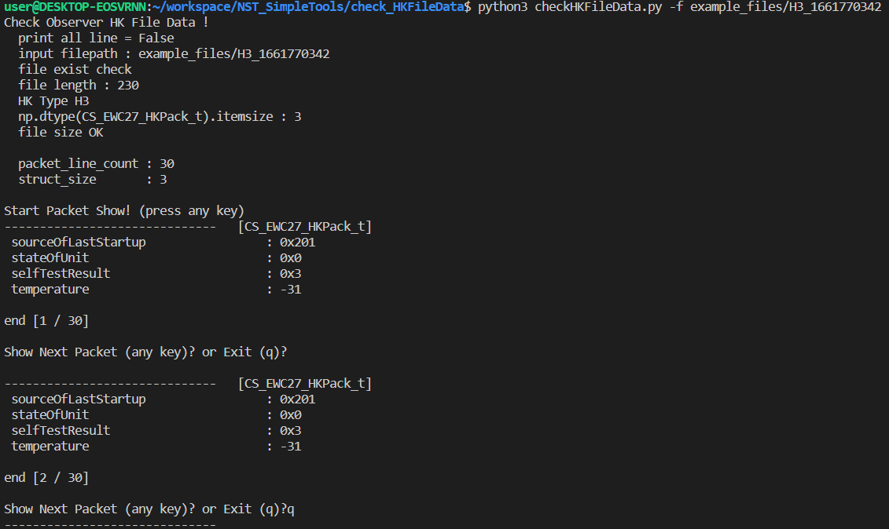

# Tool for 'Check HK File Data'

[ Purpose ]

    1. Observer의 FSW가 생산하는 HouseKeeping Data 확인.
    2. 임의로 FSW가 넣은 Dummy 값과 맞는지 확인

[ Execute Condition ]

    Observer FSW에서 생성한 HouseKeeping Data File이 필요.
    HouseKeeping Data File의 File Name의 앞 두자리를 이용해 HK 파일의 형식을 알아내고
    그에 따른 HK 구조체로 파싱하게 됨.

    // HK File Name에 따른 HK 데이터 분류
    H1 -> Main HK Data
    H2 -> AOCS HK
    H3 -> EWC27 HK
    H4 -> PDHS HK
    H5 -> Polcube HK
    H6 -> AOCS Extra HK

[ Useage ]

    python3 checkHKFileData.py -f {파일상대경로}        # 모든 데이터 출력

    python3 checkHKFileData.py -f {파일상대경로} -o     # 더미 데이터와 일치하지 않는 경우만 콘솔 출력

[ ScreenShot ]

